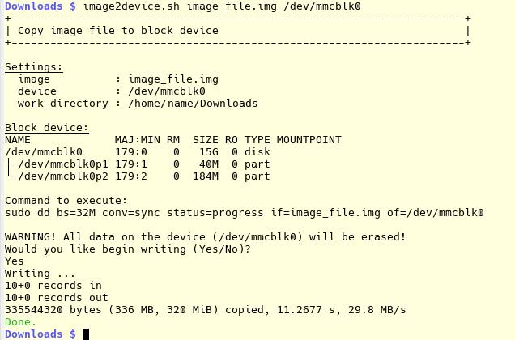

# Introduction

**image2device.sh** is a script to copy a image-file to a block device(SD card, Flash drive, etc.),
it is just a wrapper for the *dd* and *bmaptool* tools.

This script simplify usage *dd* and it just a bit more useful then alias:

    alias dd_sync="dd bs=32M conv=sync status=progress"

For [bmap-tools](https://github.com/intel/bmap-tools) it replaces a couple of commands:

    bmaptool create -o <bmap-name.bmap> <image-name.img>
    sudo bmaptool copy --bmap <bmap-name.bmap> <image-name.img> </path/to/device>

# Usage

## Install

### Install from the package

For Fedora OS: download latest [package](https://github.com/yuravg/image2device/releases) and install:

    $ sudo rpm -i image2device-<version.release.arch>.rpm

For Debian OS: download latest [package](https://github.com/yuravg/image2device/releases) and install:

    $ sudo deb -i <name>.deb

### Install by copy the script

- download the [script](https://raw.githubusercontent.com/yuravg/image2device/master/image2device.sh)

- copy the script file to some PATH directory (~/bin, /user/local/bin, etc.)

- set the script permission to execute

Example:

    $ mv -v image2device.sh ~/bin/
    $ sudo chmod +x ~/bin/image2device.sh

or

Clone Git repository `git clone https://github.com/yuravg/image2device.git` and run in the image2device directory:

    $ sudo make install

## Write image to device

If the script is invoked without command line arguments or
with command line argument --help (or -h) then it displays help message and exits.

Template:

    $ <script_name> <path-to-image> <path-to-device>

### Examples

For use *dd*

    $ image2device.sh ./sdimage.img /dev/sdc

For use *bmaptool*

    $ image2device.sh -b ./sdimage.img /dev/sdc

## Screenshot

